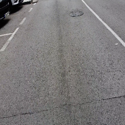
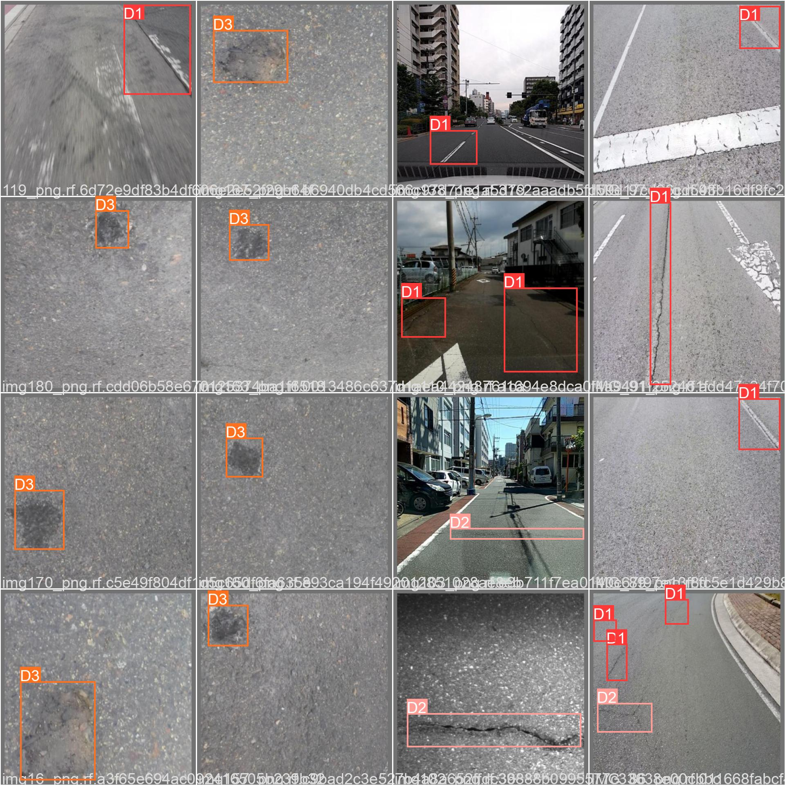
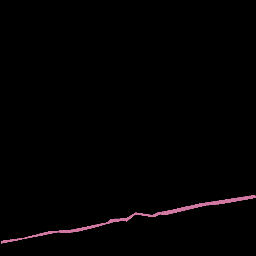

<h1>SISTEMA DE GESTIÓN DE PAVIMENTOS BASADO EN INTELIGENCIA ARTIFICIAL</h1>

**¿Por qué queremos hacerlo?**
 
- Factor económico (inversión alta en mantenimiento correctivo e incremento vida útil carretera).
- Factor medioambiental (alto consumo de energía y emisiones GHG para mantenimiento correctivo).
- Factor social (comfort y seguridad).

**¿En qué nos vamos a centrar?**
 
- **Deterioros superficiales** (*Pavement Condition Index*).
- Rugosidad (*International Roughness Index*).
- Adecuación estructural (*Structural Number*).
- Seguridad (*Skid Resistance*).

**¿Cómo estamos abordando cada fase del sistema de gestión de pavimentos?**
 

- **Colección de imágenes**: Cámara montada en vehículo de bajo coste (600 euros), rápida adquisición y alta calidad -> Imágenes georeferenciadas.
  - COLABORACIÓN: Adquisición de imágenes en las zonas de interés de la demarcación.
  - COLABORACIÓN: Tener una base de datos =  avance (lo más próximo es el programa LTPP de la FHWA en USA).

  
  

- **Análisis de imágenes**: Detección de objetos y Segmentación Semántica.
  - COLABORACIÓN: Apoyo en el etiquetado de deterioros.
    - **DETECCIÓN DE OBJETOS.** (Dónde y qué tipo).
      

        
      

    
    - **SEGMENTACIÓN SEMÁNTICA** (Área y severidad).
      

        
      

      **IMPORTANTE**: Cada imagen está georeferenciada. Por tanto, podemos sacar por ejemplo el Pavement Condition Index (PCI) a partir del tipo de deterioro, la frecuencia de deterioro, área y severidad. Entonces, la idea es mostrar en la herramienta final un mapa por colores en función del valor del PCI que les sirva como mecanismo para activar el plan de mantenimiento.
- **Elaboración de planes de mantenimiento óptimo y estudios de coorrelación**: Índice de condición del pavimento.

  - Esta herramienta será creada para la administración de carreteras y que mejor SOLUTION/PROBLEM fit que seáis vosotros quién propogáis vuestras necesidades para que nosotros os demos análisis: correlación IRI con PCI, deflexión con PCI, tasa de accidentes con PCI,etc.
  - Creación de una herramienta donde el cuerpo de operarios vuelque las imágenes y automáticamente se pueda ver el reporte.

